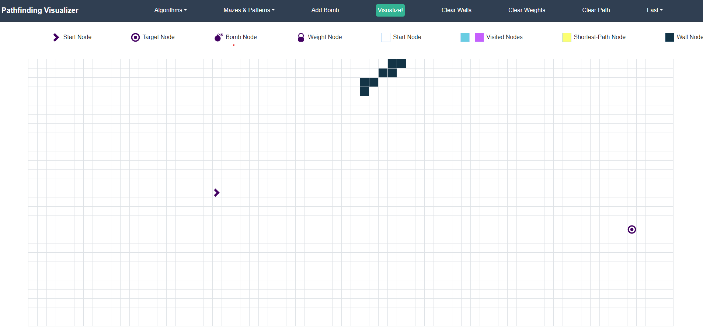

# Pathfinding Visualizer
To try out this project:
 - Make sure node.js is installed on your machine. check out <a href="https://nodejs.org/en/download/source-code">this</a> link if you don't have it installed. 
- Download this project locally or use git clone.
- Open the terminal/powershell and navigate to the downloaded folder and 
- Type in the following commands:
  ```npm install```
  ```npm start```
  This will succesfully launch the program

  

# How does it work?
The arrow on the left denotes the start node, and the target on the right denotes the end node. If you drag the mouse over the grad and hold the mouse button down, it will place walls. These walls are obstacles for the pathfinding algorithms and the algorithms can't get through them.  

# Obstacle generation
There are 4 methods of generating obstacles:
- Recursive Division. Used to generate a maze
- Basic Random Maze. Used to generate walls randomly
- Basic Weight Maze. Used to generate random weights for the weighted algorithms
- Simple Stair Pattern. Used to generate a diagonal line of walls.

# Algorithms
There are 5 methods of grid traversal:
- Dijkstra's Algorithm: Most often used in graph problems, but it can be extended to work on grids
- A* Search: Really smart algorithm that solves mazes quickly
- Greedy Best-first Search: A greedy approach that works towards the end goal
- Breadth-first Search: Grid traversal by looking at all neighbors of the starting nodes, then checking their neighbors etc.
- Depth-first Search: Grid traversal by exhausting neighbors in the same direction

